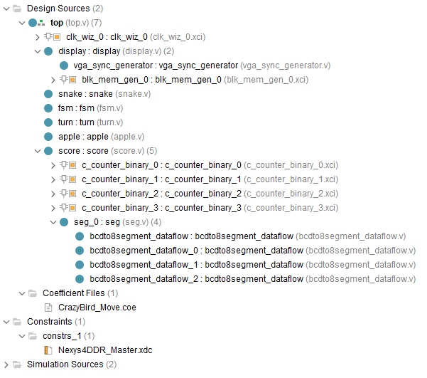

# Greedy_Snake_Verilog

Greedy Snake game on Nexys 4 DDR with Verilog.

鸣谢 @tiezhu-lee，参考了你的项目 (https://github.com/tiezhu-lee/Greedy_Snake);

## 1. 游戏说明

### 1.1 操作方式

| 按键               | 功能         |
| ------------------ | ------------ |
| 上、下、左、右按钮 | 转向         |
| 中间按钮           | 重新开始     |
| Switcher 0         | 暂停/继续    |
| Switcher 1         | 调节移动速度 |

### 1.2 功能说明

- 基本功能（转向，随机生成苹果，显示分数……）；

- 暂停/继续；

- 调速；

- 重新开始；

- 死亡时（撞墙或撞自己）蛇身闪烁两秒；

- 启动图（如下）。

  

## 2. 代码说明
### 2.1 程序结构

#### 2.1.1 图示

#### 2.1.2 文字说明

- top (主模块，用于调用各个模块)
  - clk_wiz (用于生成vga扫描时钟信号)
  - display (显示模块，用于显示启动图、苹果、墙壁、蛇)
    - vga_sync_generator (生成VGA行、列同步信号)
    - blk_men_gen (调用ROM，存储启动图数据)
  - snake (蛇模块，负责蛇的运动、死亡检测、得分检测等)
  - fsm (状态机，用于游戏状态的初始化和转换)
  - turn (转向模块，用于生成next_direction)
  - apple (苹果模块，用于生成苹果的坐标)
  - score (计分模块，输出seg和an的信息)
    - c_counter_binary  x4 (内置的counter，用于计数)
    - seg (用于将每个四位二进制数在数码管上显示出来)
      - bcdto8segment_dataflow x4 (四位BCD码转为数码管编码)
- CrazyBird_Move.coe (ROM的初始化文件，存储启动图信息)
- Nexys4DDR_Master.xdc (管脚约束文件)

### 2.2 变量说明（部分）

| 变量               | 功能           | 变量                          | 功能             |
| ------------------ | -------------- | ----------------------------- | ---------------- |
| CLK100MHZ          | 100MHz时钟     | CLK148DOT5MHZ                 | 148.5Mhz时钟     |
| reset              | 重新开始       | [32*6-1:0] snake_.._temp      | 蛇身坐标临时变量 |
| up,right,down,left | 方向键         | [31:0] snake_piece_is_display | 控制体长         |
| pause              | 暂停           | [5:0] apple_..                | 苹果坐标         |
| slow_down          | 减速           | [1:0] game_status             | 游戏状态         |
| [7:0] an           | 数码管使能     | [1:0] .._direction            | 方向             |
| [7:0] seg          |                | get_apple                     | 吃到苹果         |
| [11:0] vga         | vga颜色信号    | hit_..                        | 撞死否           |
| h_sync,v_sync      | 行、列扫描信号 |                               |                  |

### 2.3 状态机说明

| 状态         | 编码  | 意义           | 下一状态                     | 备注                        |
| ------------ | ----- | -------------- | ---------------------------- | --------------------------- |
| LAUNCHING    | 2'b00 | 正在显示启动图 | 数秒后到INITIALIZING         | 刚开机时的状态              |
| PLAYING      | 2'b01 | 正在游戏       | 撞墙或撞自己后到DIE_FLASHING |                             |
| DIE_FLASHING | 2'b10 | 死亡闪烁       | 两秒后到INITIALIZING         |                             |
| INITIALIZING | 2'b11 | 等待开始       | 按下方向键到PLAYING          | 任意状态下按下reset进入此态 |

### 2.4 实现方法（部分）

| 功能             | 实现方法                                                     |
| ---------------- | ------------------------------------------------------------ |
| VGA显示          |                                                              |
| 随机生成苹果坐标 |                                                              |
| 计分             | 调用四个counter，get_apple作为enable                         |
| 检测是否撞到自己 | `snake_x[0]==snake_x[i] && snake_y[0]==snake_y[i] && snake_piece_is_display[i]==1)`,i=1,2,3... |
| 存储蛇长         | `reg [31:0] snake_piece_is_display;`                         |
| 蛇长加一         | `snake_piece_is_display<=2*snake_piece_is_display+1;`        |
| 传递二维数组     | Verilog不允许模块间直接传递二维数组，故使用                  |
| 蛇身闪烁         |                                                              |
|                  |                                                              |

## 3. 游戏截图

